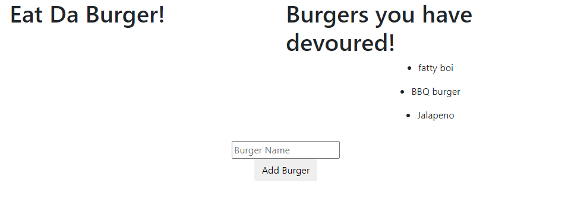
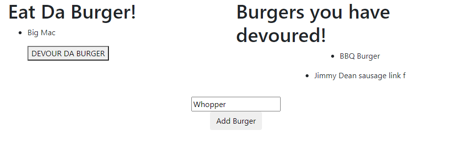
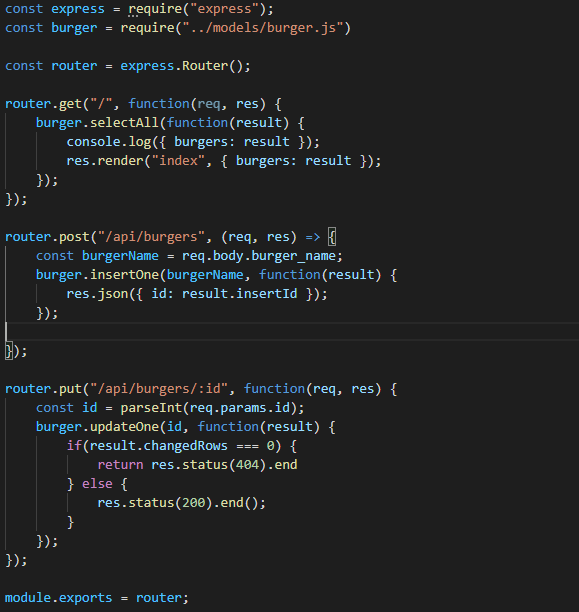

# Eat Da Burger

## Description 

Hungry? Want to eat a burger? This app is for you! Eat Da Burger is a simple full stack application that lets you add your own burger and then devour it. It uses a variety of dependencies and is fully deployed on Heroku.

## Table of Contents 

* [Description](#Description)
* [Installation](#Installation)
* [Usage](#Usage)
* [Credits](#Credits)
* [License](#License)
* [Contributions](#Contributions)
* [Tests](#Tests)
* [Questions](*Questions)

## Installation

In order to install, run "npm install" in the directory to get all of the needed dependencies.

## Usage

You can run the file in your node terminal, or use it straight from Heroku.

## Credits

Me! Alex Varela.

## License

MIT

## Contributing

Open source! Feel free to use this code for whatever purposes you need it for.

## Tests

No tests were created for this application.

## Questions

You can email me or contact me on GitHub!

Reach out to me!

Email: alexvar93@gmail.com
GitHub Profile: Fatmoogle || fatmoogle@github.io 

---
© 2019 Trilogy Education Services, a 2U, Inc. brand. All Rights Reserved.

